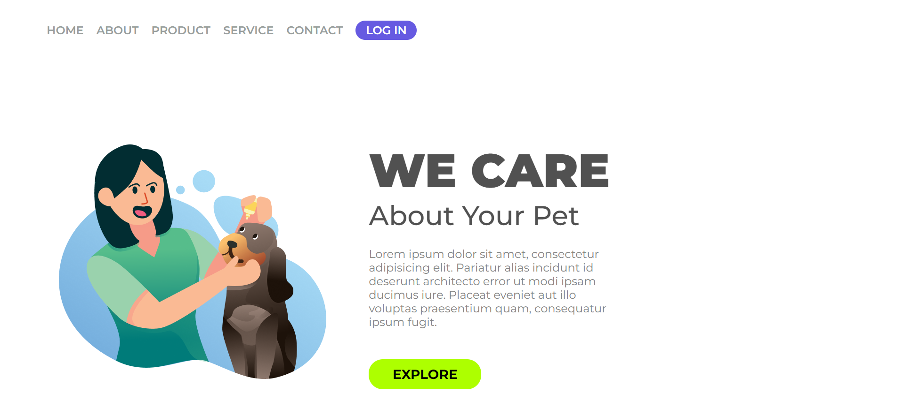
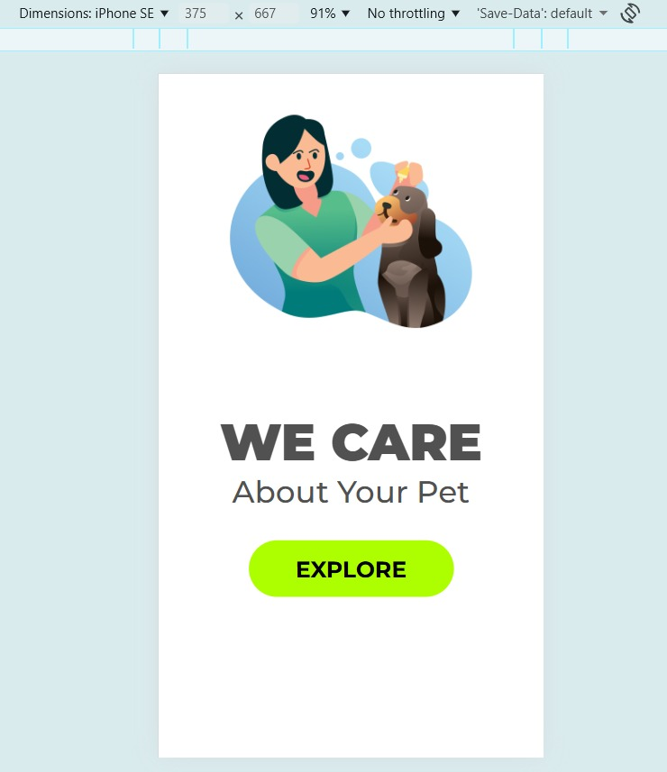

# 🐾 Pet Landing Page

Este projeto é uma landing page responsiva desenvolvida com **HTML5** e **CSS3**, com foco em apresentação de serviços voltados ao cuidado de animais de estimação.

A interface foi construída com uma estrutura simples e organizada, priorizando uma experiência visual agradável e adaptação para diferentes tamanhos de tela.

O layout apresenta uma seção principal com imagem ilustrativa, título de destaque, descrição do serviço e um botão de ação, além de um menu de navegação no topo da página.

## 🚀 Tecnologias utilizadas

- HTML5
- CSS3

## 📱 Responsividade

O projeto possui adaptação para dispositivos móveis utilizando **media queries**, reorganizando os elementos da página e simplificando o layout para telas menores.

## 🎯 Objetivo do projeto

Este projeto foi desenvolvido com o objetivo de praticar conceitos fundamentais de desenvolvimento front-end, como:

- Estruturação de páginas com HTML
- Estilização com CSS
- Organização de layout
- Responsividade para dispositivos móveis

🔗 Acesse o projeto online: https://brunorael.github.io/Projeto-Pet/

## 📸 Preview

